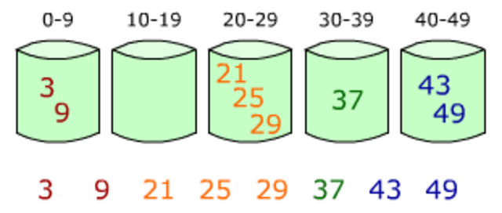

# Algorithms

## Table of Contents
- [Sorting](#sorting)
- [Cycle detection](#cycle-detection)
- [Graphs algorithms](#graphs-algorithms)
- [Trees traversals](#trees-traversals)
- [Greedy Algorithms](#greedy-algorithms)
- [Bitmasks](#bitmasks)
- [String searching](#string-searching)
- [Runtime Analysis](#runtime-analysis)

## Sorting

### Quicksort
* *Quicksort* is a **divide and conquer** algorithm. 
* Time Complexity:
  * Worst Case: `O(n²)`
  * Average Case: `O(nlog(n))`
  * Best Case: `O(nlog(n))`

### Mergesort
* *Mergesort* is also a **divide and conquer** algorithm. It continuously divides an array into two halves, recurses on both the left subarray and right subarray and then merges the two sorted halves
* Time Complexity:
  * Worst Case: `O(nlog(n))`
  * Average Case: `O(nlog(n))`
  * Best Case: `O(nlog(n))`

### Insertion sort
* Time Complexity:
    * Worst Case: `O(n²)`
    * Average case: `O(n²)`
    * Best Case: `O(n)`

### Bucket Sort
* *Bucket Sort* is a sorting algorithm that works by distributing the elements of an array into a number of buckets. Each bucket is then sorted individually, either using a different sorting algorithm, or by recursively applying the bucket sorting algorithm
* Time Complexity:
  * Best Case: `Ω(n + k)`
  * Worst Case: `O(n^2)`
  * Average Case:`Θ(n + k)`

<div style="text-align: center">
    
</div>

### Radix Sort
* **Radix Sort** is a sorting algorithm that like bucket sort, distributes elements of an array into a number of buckets. However, radix sort differs from bucket sort by 're-bucketing' the array after the initial pass as opposed to sorting each bucket and merging
* Time Complexity:
  * Best Case: `Ω(nk)`
  * Worst Case: `O(nk)`
  * Average Case: `Θ(nk)`


## Cycle detection
* **Floyd's tortoise and hare** algorithm is used for cycle detection, espcially in linked lists.
* Idea: two pointers, that run at two different speeds. If there is a cycle, the two pointers will meet at a node. Else, the faster pointer will be blocked, i.e. won't be able to move forwards.
* With this algorithm, it is also possible to find the index of the beginning of the cycle. Approach: put two pointers, one at the the beginning of the list, the other one at the meeting point between the tortoise and hare. Then move the two pointers at the same speed 1. They will meet together at the beginning of the cycle.
* Proof: let's denote C the length of the cycle, L the length of the portion without the cycle and x the portion of the cycle where the two pointers meet. Then the slow pointer has reached $L + K.C + x $ and the fast one $L + K'.C + x$. As the hare runs two times faster than the tortoise, we have: $$2.(L + K.C + x) = L + K'.C + x$$ Simplifications directly lead to: $ x + L = \lambda . C \rightarrow L = \lambda.C - x$. This means that $$L \mod C = C - y $$where $C - y$ is actually the distance between the meeting point and the beginning of the cycle.  

## Graphs Algorithms

### Depth First Search
* *Depth First Search* is a graph traversal algorithm which explores as far as possible along each branch before backtracking
* Time Complexity: `O(|V| + |E|)`

### Breadth First Search
* *Breadth First Search* is a graph traversal algorithm which explores the neighbor nodes first, before moving to the next
  level neighbors
* Time Complexity: `O(|V| + |E|)`
* Data structure: queue & use of the FIFO concept

### Dijkstra's Algorithm
* *Dijkstra's Algorithm* is an algorithm for finding the shortest path between nodes in a graph
* The idea is to pick a starting node. Then explore the other nodes, in priority the closest one. At each step, we update the distance for each node.
* Time Complexity: `O(|V|^2)`
* Data structure: heap

### Topological Sort
* *Topological Sort* for Directed Acyclic Graph (DAG) is the linear ordering of nodes such that for every edge from node u to node v, u comes before v in the ordering. Note that there can be multiple topological sorting for a same graph.
* Data structure: stack where elements are stored recursively
* Time Complexity: `O(|V| + |E|)`
* For the above DAG, one topological sort can be `[5,4,2,3,1,0]`
<div style='text-align: center'>

</div>


### Prim's Algorithm
* *Prim's Algorithm* is a greedy algorithm that finds a minimum spanning tree for a weighted undirected graph.
* Minimum spanning tree (MST): all vertices must be connected with the minimum weight edge
* The main idea of the algorithm is based on two elements: a set to store the vertices of the MST and at each step to pick the vertex with the lowest key value.
* Time Complexity: `O(|V|^2)`

## Trees traversals

### Inorder traversal
* Order: left, root, right. In the case of a BST, it returns the nodes in increasing order.
* Algorithm: DFS

### Preorder traversal
* The preorder traversal is done in this order: root, left, right.
* Algorithm: DFS

### Postorder traversal
* Order: left, right, root
* Algorithm: DFS

### Level order traversal
* The level order traversal of a tree is executed level by level and returns the tree levels in order.
* Algorithm: BFS using a queue

## Greedy Algorithms
* *Greedy Algorithms* are algorithms that follow the problem-solving heuristic of making the locally optimal choice at each step in the hope of eventually reaching the global optimal solution.
* Problems must exhibit two properties in order to implement a Greedy solution:
    * Optimal Substructure: an optimal solution to the problem contains optimal solutions to the given problem's subproblems
    * The Greedy Property: an optimal solution is reached by "greedily" choosing the locally optimal choice without ever reconsidering previous choices
* Example - Coin Change
    * Given a target amount V cents and a list of denominations of n coins, i.e. we have coinValue[i] (in cents) for coin types i from [0...n - 1],
      what is the minimum number of coins that we must use to represent amount V? Assume that we have an unlimited supply of coins of any type
    * Coins - Penny (1 cent), Nickel (5 cents), Dime (10 cents), Quarter (25 cents)
    * Assume V = 41. We can use the Greedy algorithm of continuously selecting the largest coin denomination less than or equal to V, subtract that
      coin's value from V, and repeat.
    * V = 41 | 0 coins used
    * V = 16 | 1 coin used (41 - 25 = 16)
    * V = 6  | 2 coins used (16 - 10 = 6)
    * V = 1  | 3 coins used (6 - 5 = 1)
    * V = 0  | 4 coins used (1 - 1 = 0)
    * Using this algorithm, we arrive at a total of 4 coins which is optimal

## Bitmasks
* Bitmasking is a technique used to perform operations at the bit level. Leveraging bitmasks often leads to faster runtime complexity and
  helps limit memory usage
* Test kth bit: `s & (1 << k);`
* Set kth bit: `s |= (1 << k);`
* Turn off kth bit: `s &= ~(1 << k);`
* Toggle kth bit: `s ^= (1 << k);`
* Multiple by 2<sup>n</sup>: `s << n;`
* Divide by 2<sup>n</sup>: `s >> n;`
* Intersection: `s & t;`
* Union: `s | t;`
* Set Subtraction: `s & ~t;`
* Extract lowest set bit: `s & (-s);`
* Extract lowest unset bit: `~s & (s + 1);`
* Swap Values:
             ```
                x ^= y;
                y ^= x;
                x ^= y;
             ```

## String searching

### LPS 
* Longest Prefix Suffix (LPS) is an array that, for a given string, gives the index of the longest prefix that is also a suffix of the string. Example: for XXAAXX, the LPS is XX.
* The goal is to build a prefix table for a string. The array will bo to then length of the string. At a given index i, the value is length of the longest prefix that is also a suffix of the substring starting from 0 and ending to i. 
### KMP Algorithm
* The Knuth Morris Pratt algorithm (KMP) is an algorithm that searches the occurences of a word in a main string. 
* Classical approach could be a brute force. However the complexity is quadratic. KMP uses LPS and a linear scan of the main string to solve the problem which reduces the complexity to O(n+m) where n and m are the length of the word and the main string.

## Runtime Analysis

#### Big O Notation
* *Big O Notation* is used to describe the upper bound of a particular algorithm. Big O is used to describe worst case scenarios

#### Little O Notation
* *Little O Notation* is also used to describe an upper bound of a particular algorithm; however, Little O provides a bound that is not asymptotically tight

#### Big Ω Omega Notation
* *Big Omega Notation* is used to provide an asymptotic lower bound on a particular algorithm


#### Little ω Omega Notation
* *Little Omega Notation* is used to provide a lower bound on a particular algorithm that is not asymptotically tight

#### Theta Θ Notation
* *Theta Notation* is used to provide a bound on a particular algorithm such that it can be "sandwiched" between
  two constants (one for an upper limit and one for a lower limit) for sufficiently large values
