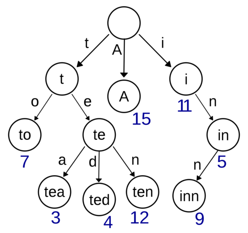
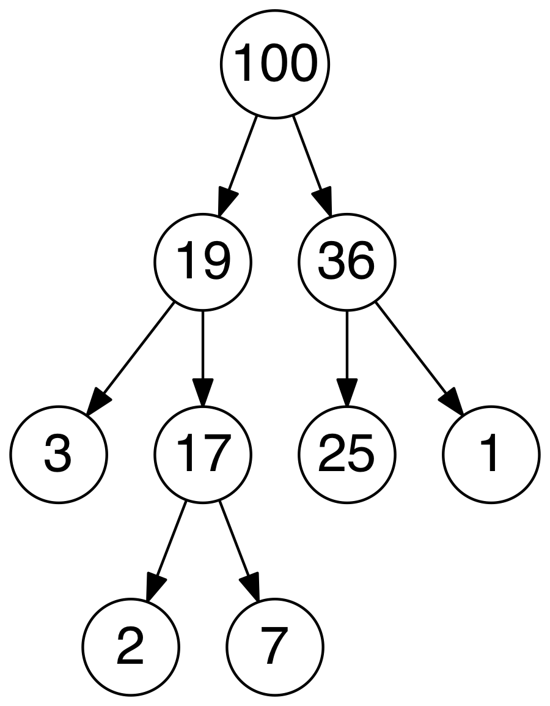

# Data structures

## Table of Contents
- [Arrays](#arrays)
- [Linked lists](#linked-lists)
- [Stacks](#stacks)
- [Queues](#queues)
- [Graphs](#graphs)
- [Trees](#trees)
- [Heaps](#heaps)
- [Hashing](#hashing)
- [Union find](#union-find)

## Arrays
 * An *array* is a collection of same type data elements that can be selected by indices.
 * Time Complexity:
   * Access: `O(n)`
   * Search: `O(n)`
   * Insert: `O(n)`
   * Remove: `O(n)`

## Linked Lists
 * A *Linked List* is a linear collection of data elements, called nodes. The order of these elements is not given by their physical placement in memory. Each element points to the next one. It is a data structure consisting of a group of nodes which together represent a sequence.
 * **Singly-linked list**: linked list in which each node points to the next node and the last node points to null
 * **Doubly-linked list**: linked list in which each node has two pointers, p and n, such that p points to the previous node and n points to the next node; the last node's n pointer points to null
 * **Circular-linked list**: linked list in which each node points to the next node and the last node points back to the first node
 * Time Complexity:
   * Access: `O(n)`
   * Search: `O(n)`
   * Insert: `O(1)`
   * Remove: `O(1)`

## Stacks
 * A *Stack* is a collection of elements, with two principle operations: *push*, which adds to the collection, and *pop*, which removes the most recently added element
 * **Last in, first out data structure (LIFO)**: the most recently added object is the first to be removed
 * A **monotonic stack** is a stack where stored elements are in monotonic increasing or decreasing order.
 * Time Complexity:
   * Access: `O(n)`
   * Search: `O(n)`
   * Insert: `O(1)`
   * Remove: `O(1)`

## Queues
 * A *Queue* is a collection of elements, supporting two principle operations: *enqueue*, which inserts an element
   into the queue, and *dequeue*, which removes an element from the queue
 * **First in, first out data structure (FIFO)**: the oldest added object is the first to be removed
 * Time Complexity:
   * Access: `O(n)`
   * Search: `O(n)`
   * Insert: `O(1)`
   * Remove: `O(1)`

## Graphs
* A *Graph* is an ordered pair of G = (V, E) comprising a set V of vertices or nodes together with a set E of edges or arcs,
  which are 2-element subsets of V (i.e. an edge is associated with two vertices, and that association takes the form of the
  unordered pair comprising those two vertices)
 * **Undirected Graph**: a graph in which the adjacency relation is symmetric. So if there exists an edge from node u to node
 v (u -> v), then it is also the case that there exists an edge from node v to node u (v -> u)
 * **Directed Graph**: a graph in which the adjacency relation is not symmetric. So if there exists an edge from node u to node v
 (u -> v), this does *not* imply that there exists an edge from node v to node u (v -> u)

## Trees
 * A *Tree* is an undirected, connected, acyclic graph

### Binary Tree
 * A *Binary Tree* is a tree data structure in which each node has at most two children, which are referred to as the *left child* and *right child*
 * **Full Tree**: a tree in which every node has either 0 or 2 children
 * **Perfect Binary Tree**: a binary tree in which all interior nodes have two children and all leave have the same depth
 * **Complete Tree**: a binary tree in which every level *except possibly the last* is full and all nodes in the last level are as far left as possible
 * In Python, a binary tree structure can be represented as following. Each element of the tree is a node that has three properties: value, left element and right element, both of them having same attributes.

### Binary Search Tree
 * A binary search tree, **BST**, is a type of binary tree which maintains the property that the value in each node must be greater than or equal to any value stored in the left sub-tree, and less than or equal to any value stored in the right sub-tree
 * Time Complexity:
   * Access: `O(log(n))`
   * Search: `O(log(n))`
   * Insert: `O(log(n))`
   * Remove: `O(log(n))`

### Trie
* A trie, sometimes called a radix or prefix tree, is a kind of search tree that is used to store a dynamic set or associative array where the keys are usually Strings. No node in the tree stores the key associated with that node; instead, its position 
in the tree defines the key with which it is associated. All the descendants of a node have a common prefix of the String associated with that node, and the root is associated with the empty String.
* This data structure is very useful for example for searching systems.
* Implementation:
  - a class TrieNode: children, endWord (to indicate if this is the end of the word)
  - just add each character one by one

## Heaps
* A *Heap* is a specialized tree based structure data structure that satisfies the *heap* property: if A is a parent node of
B, then the key (the value) of node A is ordered with respect to the key of node B with the same ordering applying across the entire heap.
A heap can be classified further as either a "max heap" or a "min heap". In a max heap, the keys of parent nodes are always greater
than or equal to those of the children and the highest key is in the root node. In a min heap, the keys of parent nodes are less than
or equal to those of the children and the lowest key is in the root node
* Time Complexity:
  * Access Max / Min: `O(1)`
  * Insert: `O(log(n))`
  * Remove Max / Min: `O(log(n))`

## Hashing
* *Hashing* is used to map data of an arbitrary size to data of a fixed size. The values returned by a hash function are called hash values, hash codes, or simply hashes. If two keys map to the same value, a **collision occurs**
* **Hash Set**: a *hash set* is a collection of items where every item is unique
* **Hash Map**: a *hash map* is a structure that can map keys to values. A hash map uses a hash function to compute an index into an array of buckets or slots, from which the desired value can be found. In Python, hashmap are implemented as dictionnaries.
* **Collision solutions**
  - Open adressing: if a hash collision occurs, the record will be moved to an alternate cell that is stated as empty
  - Separate chaining: if two records are directed to the same cell, both would go into that cell as a linked list. It efficiently prevents a hash collision, but  it can become very slow (keeping track of so many lists is difficult)

## Union find
* Union find is a data structure that stores a collection of disjoint (non overlapping) sets.
* This data structure is based on two principle operations: find & union
  * find: this operation is used to find the representative of the class of the element, i.e. the parent of the element.
  * union: this operation is used to make the union of two sets x and y
* Optimizations
  * Rank/size: for an element of the collection, we add the property ranking, to know which element of the union will be the parent
  * Path compression: it makes every node between the node and the root point to the root
